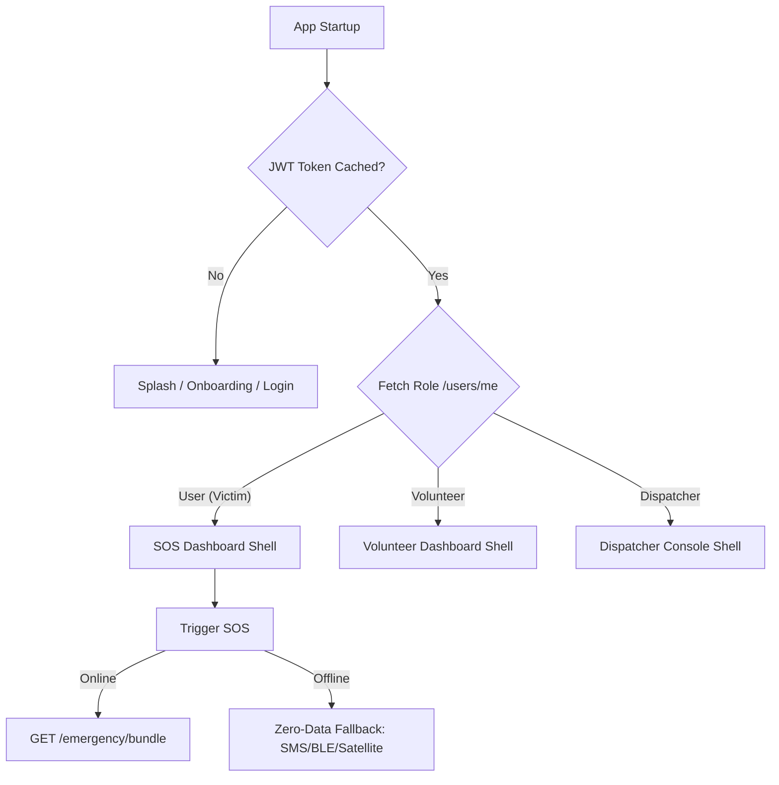

# RoadSoS Mobile App Integration & Frontend Guide

Welcome! This guide serves as the definitive reference manual for any developer building the mobile frontend (Flutter/iOS/Android) for **RoadSoS** (Offline-First Golden Hour Rescue Engine). 

The RoadSoS backend is built on FastAPI and contains deterministic triage models, background escalation loops, encrypted medical profiles, real-time WebSocket streams, and a secure Bluetooth/SMS mesh relay. Because of this complexity, the mobile app must follow a strict integration structure to guarantee 100% operation under extreme, real-world distress conditions.

---

## 1. Core Architecture & Philosophy



### The Three Pillars of the RoadSoS App:
1. **Zero-Spin Triage**: Under zero or low-connectivity environments, the app must never show a blocking spinner on the SOS path. Local triage should engage instantly using cached resources.
2. **Atomic Idempotency**: If the user presses the SOS button multiple times in panic, the app uses a unique `client_reference_id` (uuid) or relies on the backend's 5-minute deduplication window to prevent spawning duplicate dispatches.
3. **Role-Awareness**: The frontend dynamically shifts its layout and routing boundaries based on whether the logged-in user is a standard citizen (Victim/Bystander), an active Volunteer Responder, or a regional Dispatcher.

---

## 2. Chronological Screen Inventory & Navigation Map

The app uses `go_router` for deep-linking and role-based redirect guards. Below is the list of screens, buttons, and routing paths.

### Phase 1: Splash & Onboarding
* **Screen 1: Splash Screen (`/`)**
  * *Features:* Checks if a JWT exists in `flutter_secure_storage`. 
  * *Routing:* If no JWT, routes to `/onboarding`. If JWT exists, calls `GET /users/me` and routes to the appropriate shell page based on user role.
* **Screen 2: Onboarding Carousel (`/onboarding`)**
  * *Features:* Guides the user through permission setups: Background Location, Bluetooth, Notification, SMS. Requests battery optimization exemption (`REQUEST_IGNORE_BATTERY_OPTIMIZATIONS`).
  * *Buttons:* "Grant Permissions", "Skip", "Get Started".
  * *Routing:* Routes to `/auth/login` on completion.

### Phase 2: Authentication
* **Screen 3: Login Screen (`/auth/login`)**
  * *Features:* Phone number and password entry. Limits input to digits and normalizes spaces. Rate-limited to 10 attempts/min.
  * *Buttons:* "Login", "Create Account" (routes to `/auth/register`).
  * *API Call:* `POST /auth/login` (Returns access token and user info).
  * *Post-Action:* Stores JWT, calls `GET /auth/mesh-relay-key` immediately to pre-cache the BLE signing key in secure storage.
* **Screen 4: Registration (`/auth/register`)**
  * *Features:* Fields for Name, Phone, Email, Password, Blood Group, Medical Conditions, Allergies, and an expandable list of Emergency Contacts (Name, Phone, Relation, Notify-on-SOS).
  * *Buttons:* "Sign Up", "Back to Login".
  * *API Call:* `POST /auth/register` (Returns access token, encrypts medical fields on write).

### Phase 3: Authenticated User Shell (`/home` - Role-aware Bottom Navigation)
#### View A: Citizen / Victim / Bystander (Role: `user`)
* **Tab 1: SOS Trigger Screen (`/home/sos`)**
  * *Buttons:* 
    * **"THE BIG RED BUTTON"**: Triggers emergency. Launches a 3-second countdown to cancel accidental presses.
    * **"Silent SOS" toggle**: Silences audible alerts and flashes on the UI.
    * **"Bystander Mode" toggle**: Dispatches help for someone else (disables profile attachment, allows inputting victim details).
    * **"Voice SOS" button**: Records a 5-10 second audio description.
  * *Sensor Integration:* Continuously monitors accelerometer. If impact force $\ge 8.0\text{G}$ is detected, triggers P1 SOS automatically.
* **Tab 2: Services Map (`/home/map`)**
  * *Features:* Uses `flutter_map` (OpenStreetMap). Displays nearby ambulances, hospitals, police stations, and towing trucks. Works offline using a cached geohash database.
* **Tab 3: Helper Bot (`/home/helper`)**
  * *Features:* A RAG-powered chatbot for first-aid instruction. Supports multilingual text inputs.
* **Tab 4: Profile & Settings (`/home/profile`)**
  * *Features:* Encrypted view/edit of medical info and emergency contacts. Toggling volunteer mode (turns role into `volunteer`).

#### View B: Volunteer Responder (Role: `volunteer`)
* **Tab 1: Active Duty Toggle (`/volunteer/dashboard`)**
  * *Buttons:* 
    * **"Go Active" / "Go Offline"**: Toggles availability.
  * *Features:* Background service starts/stops. Sends location every 60 seconds to `PATCH /volunteers/me`. Displays history of incidents responded to.
* **Screen 5: Incoming Dispatch Alert Screen (`/volunteer/incident/:id/respond`)**
  * *Features:* Plays a custom loud siren loop. Shows victim's coordinates, distance, severity classification, and voice transcript snippet.
  * *Buttons:* "ACCEPT RESCUE" (opens navigation map), "DECLINE" (returns to dashboard).
  * *API Call:* `POST /volunteers/incidents/{incident_id}/respond`

#### View C: Dispatcher (Role: `dispatcher` / `admin`)
* **Screen 6: Dispatcher Console (`/dispatcher/dashboard`)**
  * *Features:* Real-time list of all active, acknowledged, or escalated incidents. Streamed over `/dashboard/ws`.
* **Screen 7: Incident Timeline Detail (`/dispatcher/incident/:id`)**
  * *Features:* Timeline display combining notification logs (SMS sent, Twilio statuses) and responder attempts.
  * *Buttons:* "Force Escalation", "Mark Resolved", "Verify Crowd-Sourced Report".

---

## 3. The Active SOS Triage & Execution Chronology

This is the life-critical sequence. The frontend must navigate this exactly:

```
[SOS TRIGGERED]
       │
       ├─► Has Internet Connection?
       │         │
       │         ├─► YES (Online Path)
       │         │    1. Call POST /emergency/bundle with client_reference_id
       │         │    2. Render Golden Hour Rescue Plan UI
       │         │    3. Connect to WebSocket: WS /sos/ws/{incident_id}
       │         │    4. Stream background live location updates every 3 seconds
       │         │
       │         └─► NO (Offline Path)
       │              1. Run local triage via hardcoded emergency keyword banks
       │              2. Render offline rescue advice from local Drift database
       │              3. Pre-fetch SMS Fallback message: User info + location + cached medical details
       │              4. Compile Mesh Packet: Base64 JSON signed with cached derived key
       │              5. Advertise Mesh Packet over BLE (hops = 0)
       │              6. (Android) Auto-send SMS payload; (iOS) Prompt user to send pre-filled SMS
```

### The Online Rescue Bundle Screen:
Once the online path is triggered, the response from `/emergency/bundle` returns a structured dictionary containing:
* **`golden_hour_risk_index`**: A risk coefficient (0.0 to 1.0) showing the survival danger based on severity and local service distances.
* **`recommended_action_plan`**: A step-by-step sequence detailing what the victim must do (e.g. "Prepare for ambulance arrival", "Apply pressure to wounds").
* **`medical`/`safety`/`vehicle`**: Lists of trust-scored physical responders nearby.
* **`mci_pending`**: If true, displays a massive warning: **"Multiple casualties suspected nearby. DO NOT MOVE unless in immediate danger. Wait for unified dispatch."**

---

## 4. Complete Backend API Schema Reference

Below is the exhaustive list of every api route defined in the backend. When debugging, point your developer tools to the listed file paths.

### Auth Router
| Method | Endpoint | Request Payload | Response Model | Backend Code Reference | Description |
| :--- | :--- | :--- | :--- | :--- | :--- |
| **POST** | `/auth/register` | `UserCreate` (name, phone, email, password, blood_group, medical_conditions, allergies, emergency_contacts, preferred_language) | `TokenResponse` (access_token, token_type, expires_in_minutes, user) | [auth.py](file:///c:/Users/sdiby/Downloads/roadsos/Backend/app/api/auth.py#L41-L75) | Registers user, encrypts private fields via `upsert_private_profile`. |
| **POST** | `/auth/login` | `UserLogin` (phone, password) | `TokenResponse` | [auth.py](file:///c:/Users/sdiby/Downloads/roadsos/Backend/app/api/auth.py#L77-L87) | Authenticates user and returns access JWT. Phone is normalized (spaces removed). |
| **POST** | `/auth/bootstrap-admin` | `AdminBootstrapRequest` (phone, bootstrap_token) | `{"status": "promoted", "user_id": str}` | [auth.py](file:///c:/Users/sdiby/Downloads/roadsos/Backend/app/api/auth.py#L90-L107) | Promotes user to admin. Only allowed if `ADMIN_BOOTSTRAP_ENABLED` is true. |
| **GET** | `/auth/mesh-relay-key` | *None (Requires Auth)* | `{"key": derived_key, "algorithm": "HMAC-SHA256"}` | [auth.py](file:///c:/Users/sdiby/Downloads/roadsos/Backend/app/api/auth.py#L110-L130) | Retrieves derived HMAC key unique to this user. User-specific signing key prevents leakage of master secret. |

### User Router
| Method | Endpoint | Request Payload | Response Model | Backend Code Reference | Description |
| :--- | :--- | :--- | :--- | :--- | :--- |
| **GET** | `/users/me` | *None (Requires Auth)* | `UserOut` | [user.py](file:///c:/Users/sdiby/Downloads/roadsos/Backend/app/api/user.py#L18-L21) | Fetches user profile, decrypts encrypted metadata. |
| **PATCH** | `/users/me` | `UserUpdate` (name, email, blood_group, medical_conditions, allergies, emergency_contacts, preferred_language) | `UserOut` | [user.py](file:///c:/Users/sdiby/Downloads/roadsos/Backend/app/api/user.py#L24-L39) | Partial update of user profile. Encrypts fields dynamically. |
| **POST** | `/users/me/device-token` | `DeviceTokenUpdate` (token, platform, device_id) | `DeviceTokenResponse` | [user.py](file:///c:/Users/sdiby/Downloads/roadsos/Backend/app/api/user.py#L42-L55) | Registers FCM token. Keeps last 10 devices active. |

### SOS & Incident Router
| Method | Endpoint | Request Payload | Response Model | Backend Code Reference | Description |
| :--- | :--- | :--- | :--- | :--- | :--- |
| **POST** | `/sos/trigger` | `SOSTrigger` (description, lat, lng, impact_force, source, silent, bystander_mode, victim_name, victim_phone, sensor_payload, client_reference_id) | `SOSResponse` (incident_id, priority, triage_confidence, estimated_response_time, message) | [sos.py](file:///c:/Users/sdiby/Downloads/roadsos/Backend/app/api/sos.py#L49-L97) | Atomic SOS dispatch. Runs deterministic classification. |
| **POST** | `/emergency/bundle` | `SOSTrigger` | `EmergencyBundle` (See Section 3) | [bundle.py](file:///c:/Users/sdiby/Downloads/roadsos/Backend/app/api/bundle.py#L82-L244) | Golden Hour Rescue Engine. Triggers background Overpass search if local DB has 0 services. |
| **GET** | `/sos/incidents/{incident_id}` | *None (Requires Auth)* | `IncidentOut` | [sos.py](file:///c:/Users/sdiby/Downloads/roadsos/Backend/app/api/sos.py#L100-L102) | Retrieves incident status and tracking info. |
| **PATCH** | `/sos/incidents/{incident_id}/status` | `IncidentStatusUpdate` (status, note) | `IncidentOut` | [sos.py](file:///c:/Users/sdiby/Downloads/roadsos/Backend/app/api/sos.py#L105-L118) | Transition incident status: active $\to$ acknowledged $\to$ resolved/cancelled. |
| **POST** | `/sos/incidents/{incident_id}/location` | `LiveLocationUpdate` (lat, lng, accuracy_m, speed_mps, heading_deg, battery_percent, timestamp) | `{"status": "ok"}` | [sos.py](file:///c:/Users/sdiby/Downloads/roadsos/Backend/app/api/sos.py#L121-L128) | Broadcasts victim's real-time position to WebSockets. |
| **GET** | `/sos/offline-services` | Query params: `lat`, `lng` | `OfflineServicesResponse` (geohash, services list) | [sos.py](file:///c:/Users/sdiby/Downloads/roadsos/Backend/app/api/sos.py#L131-L133) | Pre-fetches emergency services around location. |
| **GET** | `/sos/sms-fallback-payload` | Query params: `lat`, `lng` | `SMSFallbackPayload` (sms_to, message, maps_url) | [sos.py](file:///c:/Users/sdiby/Downloads/roadsos/Backend/app/api/sos.py#L136-L162) | Generates pre-formatted emergency SMS preloaded with medical info. |
| **POST** | `/emergency/voice` | Form file: `audio`, Query: `lat`, `lng` | `{"status": "success"/"fallback", "transcription": str, "bundle": bundle}` | [voice.py](file:///c:/Users/sdiby/Downloads/roadsos/Backend/app/api/voice.py#L29-L107) | Voice SOS. Sends audio to Groq Whisper and returns emergency bundle. |

### Volunteer Router
| Method | Endpoint | Request Payload | Response Model | Backend Code Reference | Description |
| :--- | :--- | :--- | :--- | :--- | :--- |
| **POST** | `/volunteers/me` | `VolunteerCreate` (name, phone, skills, lat, lng, available) | `VolunteerOut` | [volunteer.py](file:///c:/Users/sdiby/Downloads/roadsos/Backend/app/api/volunteer.py#L38-L54) | Registers volunteer profile, updates geolocated WKBElement. |
| **PATCH** | `/volunteers/me` | `VolunteerUpdate` (name, phone, skills, lat, lng, available) | `VolunteerOut` | [volunteer.py](file:///c:/Users/sdiby/Downloads/roadsos/Backend/app/api/volunteer.py#L57-L72) | Updates location and skills for an active volunteer. |
| **POST** | `/volunteers/toggle-availability` | Query: `available` (bool) | `{"status": "updated", "available": bool}` | [volunteer.py](file:///c:/Users/sdiby/Downloads/roadsos/Backend/app/api/volunteer.py#L75-L83) | Sets volunteer active or inactive. |
| **GET** | `/volunteers/nearby` | Query: `lat`, `lng`, `radius_km` | `{"volunteers": [...]}` | [volunteer.py](file:///c:/Users/sdiby/Downloads/roadsos/Backend/app/api/volunteer.py#L86-L95) | Returns active volunteers in vicinity. |
| **POST** | `/volunteers/incidents/{incident_id}/respond` | `VolunteerIncidentResponse` (action, note) | `VolunteerIncidentResponseOut` | [volunteer.py](file:///c:/Users/sdiby/Downloads/roadsos/Backend/app/api/volunteer.py#L98-L158) | Voluntarily accept or decline incident. Updates websocket stream. |

### Helper (RAG Chat) Router
| Method | Endpoint | Request Payload | Response Model | Backend Code Reference | Description |
| :--- | :--- | :--- | :--- | :--- | :--- |
| **POST** | `/helper/query` | `HelperQuery` (query, lat, lng, include_services, language) | `HelperAnswer` (answer, confidence, citations, matched_services, safety_notice) | [helper.py](file:///c:/Users/sdiby/Downloads/roadsos/Backend/app/api/helper.py#L15-L23) | Grounded AI instructions. Automatically returns emergency warnings if dangerous terms detected. |

### Data Ingestion Router
| Method | Endpoint | Request Payload | Response Model | Backend Code Reference | Description |
| :--- | :--- | :--- | :--- | :--- | :--- |
| **POST** | `/data-ingestion/services/report` | `ServiceReportCreate` (name, type, phone, lat, lng, note) | `ServiceReportOut` (id, name, type, phone, lat, lng, verification_status) | [data_ingestion.py](file:///c:/Users/sdiby/Downloads/roadsos/Backend/app/api/data_ingestion.py#L36-L43) | Citizens report a newly constructed hospital, garage or police post. |

---

## 5. Real-Time WebSockets Contract

FastAPI manages real-time state broadcasts using WebSocket endpoints. Mobile clients must handle incoming frames on the standard background UI thread.

### Incident Stream: `WS /sos/ws/{incident_id}`
Requires authentication. Pass the JWT as a query param `?token=JWT`.
The client will receive JSON payloads with a `type` key:
```json
// Type 1: Status Updated
{
  "type": "status_updated",
  "status": "acknowledged" | "resolved" | "cancelled",
  "note": "Volunteer accepted the case."
}

// Type 2: Responder Updated
{
  "type": "responder_updated",
  "volunteer_id": "90fb4b3e-...",
  "status": "accepted" | "declined",
  "incident_status": "acknowledged"
}

// Type 3: Live Location Broadcast
{
  "type": "location_updated",
  "lat": 18.9754,
  "lng": 72.8258,
  "accuracy_m": 5.0,
  "speed_mps": 0.0,
  "heading_deg": 120.0
}

// Type 4: MCI provisional alarm
{
  "type": "mci_provisional",
  "cell": "te3y6",
  "hot_path_count": 4,
  "threshold": 3,
  "message": "Multiple casualties suspected nearby. Stay put unless in immediate danger."
}
```

---

## 6. BLE Mesh Relay Mechanics & Crytpography

When there is no cellular network, the app acts as a relay hopper. It generates a signed packet containing critical distress parameters and broadcasts it over BLE. 

### Packet Structure
```json
{
  "payload_b64": "eyJpIjogIjkwZmI0YiIsICJ1IjogIjJiM...",
  "signature": "8a7c2b5f9e0a2d3c4b5f6e7d...",
  "hops": 0
}
```

### Decompiled Payload Structure
```json
{
  "i": "90fb4b3e-7253-4889-8d14-7d52a233b8a1",  // Incident UUID
  "u": "2b3c4d5e-...",                        // User UUID
  "l": [18.9754, 72.8258],                    // Lat/Lng coords
  "p": "P1_CRITICAL",                         // Priority Enum
  "t": 1780829390                             // Epoch seconds timestamp
}
```

### The Signing Handshake:
1. When **online**, the app calls `GET /auth/mesh-relay-key` and stores the hex key in the Keychain/Secure storage.
2. When **offline and triggering SOS**, the app constructs the payload JSON.
3. It signs the Base64 representation of the payload using **HMAC-SHA256** with the stored user derived key:
   $$\text{Signature} = \text{HMAC-SHA256}(\text{derived\_user\_key}, \text{payload\_b64})$$
4. The app advertises this packet. Nearby devices running RoadSoS receive it via BLE, increment the `hops` field, and save it in their local sync queues.
5. When any peer device regains cellular internet, it uploads the packet to `/emergency/mesh-relay`. The server validates the signature and immediately creates a **Ghost Incident** in the database to trigger official rescue dispatches.

---

## 7. Critical Mobile Developer Integration Caveats

> [!WARNING]
> **No JWT Refresh Token Endpoint**
> The backend currently lacks an `/auth/refresh` route. Access tokens have an expiration of 24 hours (`ACCESS_TOKEN_EXPIRE_MINUTES = 1440`). Ensure the mobile app catches `401 Unauthorized` errors in the HTTP interceptor, caches any active incident state, forces authentication, and immediately restores the tracking socket to prevent losing connection to active responders.

> [!IMPORTANT]
> **WebSocket Security Notice**
> The JWT token is passed as a query string parameter on the WebSocket handshake: `ws://api.roadsos.io/sos/ws/{id}?token={JWT}`. Be aware that intermediate proxy systems or firewalls may write this query parameter to server log files. The development team must ensure that reverse proxies (Nginx/Cloudflare) strip URL arguments from logs.

> [!TIP]
> **Aggressive Mobile Carrier Timeouts**
> Mobile carriers drop idle TCP connections after 60-90 seconds. To prevent the tracking socket from going stale, you must implement a client-side heartbeat. Listen for `{"type": "ping"}` sent by the backend every 25 seconds, or send an empty frame to keep the socket alive. If no frame is received for 35 seconds, immediately execute a reconnect backoff loop.
